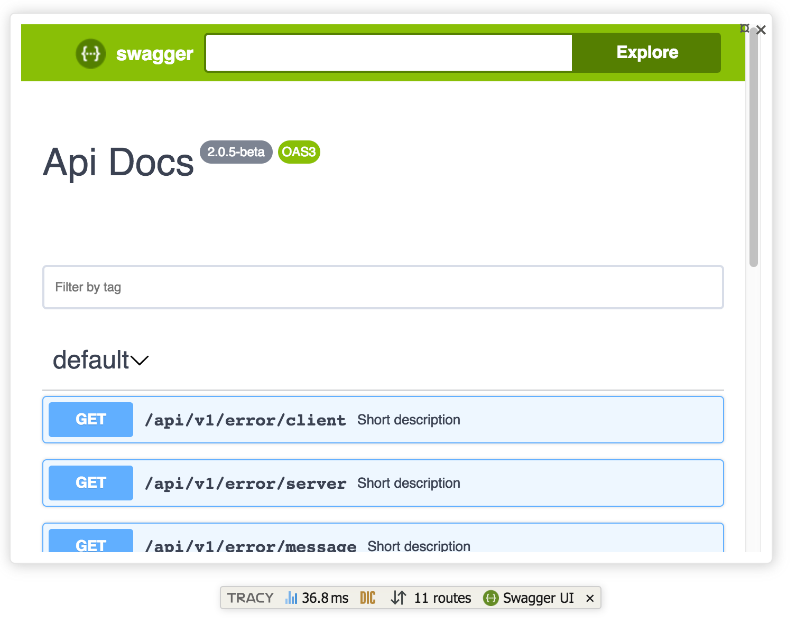

# Contributte OpenApi

Pure PHP OpenAPI implementation for Nette Framework, supporting 3.0 and 3.1.

## Content

- [Setup](#setup)
- [Supported versions](#supported-versions)
- [OpenAPI](#tracy)
- [Version validation](#version-validation)
- [Tracy](#tracy)

## Setup

Install package

```bash
composer require contributte/openapi
```

## OpenAPI

- [Callback.php](../src/Schema/Callback.php)
- [Components.php](../src/Schema/Components.php)
- [Contact.php](../src/Schema/Contact.php)
- [Example.php](../src/Schema/Example.php)
- [ExternalDocumentation.php](../src/Schema/ExternalDocumentation.php)
- [Header.php](../src/Schema/Header.php)
- [Info.php](../src/Schema/Info.php)
- [License.php](../src/Schema/License.php)
- [Link.php](../src/Schema/Link.php)
- [MediaType.php](../src/Schema/MediaType.php)
- [OAuthFlow.php](../src/Schema/OAuthFlow.php)
- [OpenApi.php](../src/Schema/OpenApi.php)
- [Operation.php](../src/Schema/Operation.php)
- [Parameter.php](../src/Schema/Parameter.php)
- [PathItem.php](../src/Schema/PathItem.php)
- [Paths.php](../src/Schema/Paths.php)
- [Reference.php](../src/Schema/Reference.php)
- [RequestBody.php](../src/Schema/RequestBody.php)
- [Response.php](../src/Schema/Response.php)
- [Responses.php](../src/Schema/Responses.php)
- [Schema.php](../src/Schema/Schema.php)
- [SecurityRequirement.php](../src/Schema/SecurityRequirement.php)
- [SecurityScheme.php](../src/Schema/SecurityScheme.php)
- [Server.php](../src/Schema/Server.php)
- [ServerVariable.php](../src/Schema/ServerVariable.php)
- [Tag.php](../src/Schema/Tag.php)

## Supported versions

| OpenAPI | Support |
|---------|---------|
| 3.0     | yes     |
| 3.1     | yes     |

`tests/Cases/VersionSupportTest.php` backs both rows with a complete document per version -
`tests/Cases/Schema/examples/complete-3-0.yaml` and `complete-3-1.yaml` - each using every field
its version defines, except where the specification makes two fields mutually exclusive and only
one of them can appear. For each document the test requires that a `fromArray()`/`toArray()` round
trip loses nothing and that `VersionValidator` reports no problem. For the fields a version
introduced, it additionally requires the document to exercise them, so a later version cannot be
called supported while its additions go untested.

## Version validation

The schema classes accept any document, whatever version it declares. `VersionValidator`
reports constructs that do not belong to that version - for example a 3.0 document using
`webhooks`, which was introduced in 3.1.

```php
use Contributte\OpenApi\Schema\OpenApi;
use Contributte\OpenApi\Validator\VersionValidator;

$openApi = OpenApi::fromArray($data);

foreach ((new VersionValidator())->validate($openApi) as $problem) {
	echo $problem; // [warning] webhooks: Attribute "webhooks" was introduced in OpenAPI 3.1, but the document declares 3.0.
}
```

Problems are returned, never thrown. Each one carries a level (`Problem::LEVEL_WARNING` or
`Problem::LEVEL_ERROR`), a dot-separated path and a message.

A document that declares no version is read as `Version::DEFAULT`, which is 3.0 - the
version this library implemented before it could tell versions apart.

`Version` compares version strings on their own:

```php
use Contributte\OpenApi\Version;

Version::match('3.0.4', '3.0.x'); // true
Version::isSupported('3.1.1');    // true
```

## Tracy



```neon
services:
    swaggerPanel:
        class: Contributte\OpenApi\Tracy\SwaggerPanel()
        setup:
            - setSpec([...openapi])
            - setLazySpec([@openapi, getSpec])
            - setUrl('https://petstore.swagger.io/v2/swagger.json')
            - setExpansion()
            - setFilter("role=User")
            - setTitle(MyAPI)

tracy:
	bar:
		- @swaggerPanel
```
